# 🎓 Diploma Verification System

> **Production-Ready Blockchain Application for Diploma Authentication**

A decentralized diploma verification system built on Ethereum that allows universities to issue verifiable diplomas and enables instant verification by employers, institutions, or individuals.

[](https://ethereum.org/)
[](https://soliditylang.org/)
[](https://hardhat.org/)
[](https://opensource.org/licenses/MIT)

## 🌟 **Key Features**

- ✅ **Instant Verification** - Verify any diploma in under 2 seconds
- 🏛️ **University Management** - Authorized universities can issue diplomas on-chain
- 🔐 **Cryptographic Security** - Uses Keccak-256 hashing for tamper-proof records
- 🌐 **Multi-Network Support** - Deploy on localhost, Sepolia testnet, or mainnet
- 📱 **MetaMask Integration** - Seamless wallet connection and transaction signing
- 🔒 **Access Control** - Role-based permissions with OpenZeppelin contracts
- 💰 **Gas Optimized** - Minimal storage and efficient operations

## 🚀 **Quick Start**

### Prerequisites
- [Node.js](https://nodejs.org/) (v18+ recommended)
- [MetaMask](https://metamask.io/) browser extension
- [Git](https://git-scm.com/)

### Installation
```bash
# Clone the repository
git clone <your-repo-url>
cd diploma_verif

# Install dependencies
npm run setup

# Start local development
npm run dev
```

This will:
1. Start a local Hardhat node on `http://127.0.0.1:8545`
2. Deploy the contract locally
3. Launch the frontend application

## 🏗️ **Project Structure**

```
diploma_verif/
├── contracts/              # Smart contracts
│   └── DiplomaRegistry.sol     # Main verification contract
├── test/                   # Contract tests
│   └── DiplomaRegistry.test.js # Comprehensive test suite
├── ignition/modules/       # Deployment scripts
│   └── Deploy.js              # Contract deployment
├── frontend/               # Frontend application
│   └── src/
│       └── index.html         # Single-page application
├── docs/                   # Documentation
├── .env                    # Environment configuration
└── hardhat.config.js       # Hardhat configuration
```

## 🔗 **Network Configuration**

### Local Development (Default)
- **Network**: Localhost  
- **Chain ID**: 31337
- **RPC URL**: `http://127.0.0.1:8545`
- **Contract**: Auto-deployed on startup

### Sepolia Testnet
- **Chain ID**: 11155111  
- **RPC URL**: Alchemy endpoint (in `.env`)
- **Faucet**: [Sepolia Faucet](https://sepoliafaucet.com/)

## 🦊 **MetaMask Setup Guide**

### 1. Install MetaMask
1. Install [MetaMask extension](https://metamask.io/download/)
2. Create or import a wallet
3. Secure your seed phrase

### 2. Add Local Network (Development)
1. Open MetaMask settings
2. Navigate to **Networks** → **Add Network**
3. **Add Manually** with these details:
   ```
   Network Name: Hardhat Local
   New RPC URL: http://127.0.0.1:8545
   Chain ID: 31337
   Currency Symbol: GO
   ```

### 3. Import Test Account (Development)
1. Copy a private key from Hardhat's startup output
2. MetaMask → **Import Account** → Paste private key
3. You now have 10,000 ETH for testing!

### 4. Add Sepolia Testnet
1. MetaMask → **Networks** → **Add Network**  
2. Select **Sepolia** from popular networks
3. Get test ETH from [Sepolia Faucet](https://sepoliafaucet.com/)

## 📋 **How to Use**

### 👤 **Admin Setup** (First Time Only)
1. Connect MetaMask with admin account
2. Add universities using the **Admin Panel**:
   ```
   University Name: "Harvard University"
   Address: 0x742d35Cc662C...
   ```

### 🏛️ **Issue a Diploma** (Universities)
1. Connect with authorized university wallet
2. Upload diploma PDF file
3. Enter university name and degree type
4. Click **Issue Diploma** → Sign transaction
5. Diploma hash is permanently stored on blockchain

### ✅ **Verify a Diploma** (Anyone)
1. Upload the diploma PDF to verify
2. Enter the expected university name  
3. Click **Verify Diploma**
4. Get instant **Authentic ✅** or **Invalid ❌** result

## 🧪 **Testing**

### Run Contract Tests
```bash
npm test
```

### Run Local Node
```bash
npm run node
```

### Deploy Contracts
```bash
# Local deployment
npm run deploy:local

# Sepolia deployment  
npm run deploy:sepolia
```

## 🔧 **Development**

### Smart Contract Development
```bash
# Compile contracts
npm run compile

# Run tests with coverage
npm run test

# Deploy to network
npm run deploy:local
```

### Frontend Development
```bash
# Start frontend only
npm run frontend:start

# Build for production
npm run frontend:build
```

## 📊 **Smart Contract Details**

### DiplomaRegistry.sol
- **Access Control**: Role-based permissions (Admin, University)
- **Gas Optimized**: Uses `uint64` for timestamps, `bytes32` for hashes
- **Security**: ReentrancyGuard, input validation
- **Privacy**: Only stores hash, not diploma content

### Key Functions
```solidity
// Admin functions
authorizeUniversity(string name, address wallet)
revokeUniversityAuthorization(string name)

// University functions  
issueDiploma(bytes32 hash, string university, bytes32 degreeType)
revokeDiploma(bytes32 hash, string university)

// Public verification
verifyDiploma(bytes32 hash, string university)
isUniversityAuthorized(string university)
```

## 🔐 **Security Features**

- **Cryptographic Hashing**: Keccak-256 ensures data integrity
- **Access Control**: OpenZeppelin role-based permissions
- **Reentrancy Protection**: Secure against common attacks
- **Input Validation**: Comprehensive parameter checking
- **Privacy by Design**: No personal data stored on-chain

## 🌐 **Deployment Guide**

### Local Deployment
```bash
# Terminal 1: Start local node
npm run node

# Terminal 2: Deploy contract
npm run deploy:local

# Terminal 3: Start frontend
npm run frontend:start
```

### Sepolia Deployment
1. Configure `.env` with your private key:
   ```env
   PRIVATE_KEY=your_private_key_here
   SEPOLIA_RPC_URL=https://eth-sepolia.g.alchemy.com/v2/your_key
   ```
2. Deploy to Sepolia:
   ```bash
   npm run deploy:sepolia
   ```
3. Update contract address in frontend

## 🐛 **Troubleshooting**

### Common Issues

**MetaMask Connection Failed**
- Ensure MetaMask is unlocked
- Check network matches application
- Refresh page and reconnect

**Transaction Failed**
- Check you have enough ETH for gas
- Verify you're using correct network
- Ensure wallet is authorized for action

**Diploma Verification Failed**
- PDF must be exact same file used for issuance
- University name must match exactly
- Check university is authorized

**Hash Generation Error**
- Ensure PDF file is valid and not corrupted
- Try refreshing page and uploading again
- Check browser console for errors

### Getting Help
1. Check [Issues](link-to-issues) for known problems
2. Review contract events in MetaMask
3. Check browser console for errors
4. Verify network and contract addresses

## 📄 **Environment Configuration**

### `.env` File Template
```env
# Sepolia Testnet Configuration
SEPOLIA_RPC_URL=https://eth-sepolia.g.alchemy.com/v2/YOUR_KEY
PRIVATE_KEY=your_private_key_without_0x

# Optional: Custom configuration
NETWORK_NAME=sepolia
CHAIN_ID=11155111
```

## 🤝 **Contributing**

1. Fork the repository
2. Create feature branch (`git checkout -b feature/amazing-feature`)
3. Run tests (`npm test`)
4. Commit changes (`git commit -m 'Add amazing feature'`)
5. Push to branch (`git push origin feature/amazing-feature`)
6. Open Pull Request

## 📜 **License**

This project is licensed under the MIT License - see the [LICENSE](LICENSE) file for details.

## 🎯 **Technical Stack**

- **Blockchain**: Ethereum, Solidity ^0.8.24
- **Development**: Hardhat, Ethers.js v5
- **Frontend**: Vanilla HTML/CSS/JavaScript
- **Security**: OpenZeppelin Contracts
- **Testing**: Hardhat Test Runner, Chai
- **Networks**: Localhost, Sepolia Testnet

## 📈 **Roadmap**

- [x] Core smart contract functionality
- [x] MetaMask integration  
- [x] PDF hash verification
- [x] Multi-network support
- [ ] IPFS integration for diploma storage
- [ ] Mobile app development
- [ ] Bulk diploma issuance
- [ ] Advanced analytics dashboard

## 🔍 **Architecture**

```mermaid
graph TD
    A[User Uploads PDF] --> B[Generate Keccak-256 Hash]
    B --> C{Action Type?}
    C -->|Issue| D[University Signs Transaction]
    C -->|Verify| E[Query Blockchain]
    D --> F[Store Hash On-Chain]
    E --> G{Hash Exists?}
    G -->|Yes| H[✅ Authentic]
    G -->|No| I[❌ Invalid]
```



---

**🚀 Ready to secure academic credentials with blockchain technology!**

For questions, support, or contributions, please open an issue or contact the development team.
